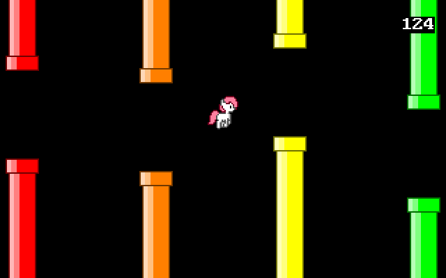

# Flappy game in x86

A simple flappy game running in OS kernel level.

You can run it in a x86 virtual machine, load the disk image into floppy drive and start. (Can run without any existing OS)

Using PC Speaker for sound. Supports PS/2 Keyboard & Mouse.



How to play: Press space key or left click to jump.

## Dev-requirements

- **NASM**
- Cross-compiler (like **i386-elf-gcc**)
- **Python**, with library **Pillow** (for generating assets)
- **QEMU** (for testing)

## Build from source

To run with QEMU:
```sh
qemu-system-x86_64 -drive file=os-image.img,format=raw -soundhw pcspk
```

To compile the source code and run with QEMU:

```sh
make
```

Assets include font and player sprite, to regenerate them:

```sh
make assets
```

## License

MIT
